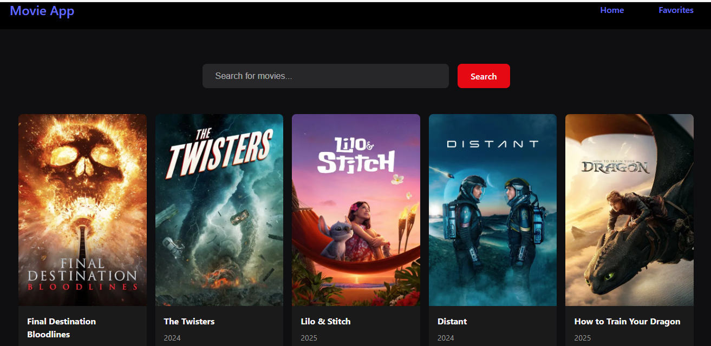

# 🎬 Movie Search App with React.js

A sleek movie search application built with React.js and the TMDB API. Search for movies, view posters, and manage your favorites — all in a clean, responsive UI.

## 🚀 Features

- 🔍 Real-time movie search
- ❤️ Add to favorites
- 🎨 Responsive, custom styling
- ⚛️ React Context API for global state
- 🎥 Powered by [TMDB API](https://www.themoviedb.org/)

## 🖥️ Tech Stack

- React.js (Vite)
- React Router DOM
- Context API
- CSS3 / Tailwind (optional)
- TMDB API

## 📸 Screenshots



## 📦 Installation

Clone the repo and install dependencies:

```bash
git clone https://github.com/Rafisayed13/movie-search-app-with-react-js.git
cd movie-search-app-with-react-js
npm install
npm run dev
